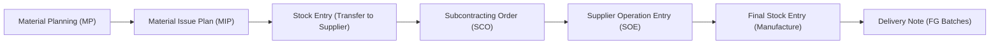

# Antigravity Session Trace & Work Log

**Date:** 2026-09-27  
**App:** `manufyxinvenzaerp`  
**Site:** `manufact`  
**Author/Agent:** Antigravity (AI Coding Assistant)  
**Target Audience:** Developer / Claude review  

---

## 1. Overview & Context

This document captures the end-to-end investigation, root causes, design decisions, code changes, and verification performed during this session on the **Manufyxinvenza ERP** manufacturing and subcontracting workflow.

### Background Workflow


The user restored a production snapshot (`20260927_151554-erp_manufyx_co_in-database.sql.gz`) on the `manufact` site to investigate and fix two critical issues blocking production execution.

---

## 2. Issue 1: Material Planning Reservation & Transfer Discrepancy

### 2.1 Problem Statement
- **Material Planning:** `MP-2026-00017` had reserved raw materials.
- **Material Issue Plan:** `MIP-2026-00007` was created.
- **Stock Entry:** `MAT-STE-00015` transferred only 3 materials (607.493 Kg).
- **Subcontracting Order:** `SC-ORD-2026-00007` showed:
  - Transferred: `607.493 Kg`
  - Not Yet Transferred: `1,061.608 Kg`
- **Symptom:**
  - When trying to transfer the balance, the system claimed rows were "all transferred" or "2 are not reserved".
  - When trying to reserve in Material Planning, it failed with `"stock not available"`, even though the system had originally suggested those batches during planning.

### 2.2 Investigation & Root Cause
1. **Double Counting in Reservation Validation:**
   - In `MaterialPlanning.validate` (and `check_mapping_batch_availability`), the code was checking free batch stock against the entire `batch_calc_qty` or `required_qty`, **without subtracting already transferred quantities (`transferred_qty`)**.
   - Because `MAT-STE-00015` had already physically moved 607.493 Kg out of the warehouse, the warehouse bin stock decreased by 607.493 Kg.
   - When the user opened `MP-2026-00017` to reserve or save, the validation compared `batch_calc_qty` against the *current* free stock (which no longer had the 607.493 Kg), falsely throwing a `"stock not available"` error.
2. **Partial Transfer in `reserve_batches` & `reserve_exact_match_batches`:**
   - The reservation loops did not skip rows where `fully_transferred == 1` or where `transferred_qty >= qty`.
   - The quantity to reserve (`to_reserve`) was computed as `required_qty` or `batch_calc_qty` instead of the *remaining* requirement: `max(0.0, required_qty - transferred_qty)`.
3. **Frontend Reservation Button Logic:**
   - In `material_planning.js`, the "Reserve" button check (`frm.doc.material_mapping.some(...)`) did not exclude rows that were already transferred (`!r.fully_transferred && flt(r.transferred_qty) < flt(r.qty)`).

### 2.3 Code Changes
#### File: `manufyxinvenzaerp/production_management/doctype/material_planning/material_planning.py`
1. **`MaterialPlanning.validate` (`_validate_batch_stock_availability`)**:
   - Calculated `needed_qty = max(0.0, batch_calc_qty - transferred)`.
   - If `needed_qty <= 0.0005`, bypassed check.
   - Validated `difference = flt(needed_qty - available, 3)` against available stock.
2. **`reserve_batches`**:
   - Skipped rows where `fully_transferred` is true or `transferred_qty >= qty - 0.001`.
   - Calculated remaining required quantity: `required_qty = max(0.0, flt(row.qty) - transferred)`.
   - Scaled `to_reserve = max(0.0, batch_calc_qty - transferred)`.
3. **`reserve_exact_match_batches`**:
   - Skipped rows already transferred.
   - Adjusted `required_qty = max(0.0, flt(row.required_qty) - transferred)`.
4. **`check_mapping_batch_availability`**:
   - Skipped already transferred rows (`is_fully_transferred or (transferred >= base_qty - 0.001 and transferred > 0)`).
   - Evaluated remaining needed quantity `max(0.0, base_qty - transferred)`.
5. **`reassign_batch`**:
   - Skipped rows that have already shipped (`not _row_has_shipped(r)`).

#### File: `manufyxinvenzaerp/production_management/doctype/material_planning/material_planning.js`
- Updated `_add_reservation_buttons` and `_add_exact_match_reservation_buttons` to filter out rows where `r.fully_transferred` is true or `transferred_qty >= qty - 0.001`.

### 2.4 Outcome
- User was able to reserve the balance items on `MP-2026-00017`.
- Transferred the remaining `1,061.608 Kg` via Stock Entry `MAT-STE-00018`.
- Total transferred weight on `SC-ORD-2026-00007` reached `1,669.101 Kg` (100% complete).

---

## 3. Issue 2: Supplier Operation Entry `SCO-SOE-0027` "Exceeds Available to Consume"

### 3.1 Problem Statement
In Supplier Operation Entry `SCO-SOE-0027` (Op-1 for `SC-ORD-2026-00007`), when the user logged all 3 drawings and attempted to transfer/save, the system raised:
> **Exceeds Available to Consume**  
> *"You have entered 1669.103 Kg, but only 1669.101 Kg is available to consume."*

### 3.2 Investigation & Root Cause
1. **Transferred Raw Material:**
   - `MAT-STE-00015` transferred 607.493 Kg.
   - `MAT-STE-00018` transferred 1061.608 Kg.
   - Total transferred = `1,669.101 Kg` (this set `doc.available_to_consume_kg = 1669.101`).
   - The 1,669.101 Kg was the sum of individual BOM raw material line items rounded to 3 decimals in Material Planning.
2. **Logged Operation Consumption:**
   - `SCO-SOE-0027` contained 3 drawings:
     - Drawing 1B6 (`DRW-2026-00319`): `qty_nos` = 1, `total_weight` = 555.891 Kg
     - Drawing 1B7 (`DRW-2026-00320`): `qty_nos` = 1, `total_weight` = 556.606 Kg (from BOM calc `556.605809...` rounded on Drawing master)
     - Drawing 1B8 (`DRW-2026-00321`): `qty_nos` = 1, `total_weight` = 556.606 Kg (from BOM calc `556.605809...` rounded on Drawing master)
     - Total entered in SOE = 555.891 + 556.606 + 556.606 = `1,669.103 Kg`.
3. **Root Cause:**
   - Rounding discrepancy between individual BOM raw material rows (which rounded down to `556.605` on individual lines in MP) versus the Drawing master header weight (which rounded to `556.606`).
   - The discrepancy was exactly **0.002 Kg (2 grams)**.
   - Line 1412 of `subcontracting.py` had a rigid check: `if available_kg > 0 and total_kg > available_kg: frappe.throw(...)`.

### 3.3 User Requirement
1. Add a setting in **Manufyxinvenza Settings** named **Weight Difference Tolerance** (`weight_difference_tolerance`), with UOM in Kg and default `0.05` Kg.
2. In Supplier Operation Entry consumption, do not block if the overage is within the allowed tolerance.
3. Show a warning message:
   *"You have entered 1669.103 Kg, but only 1669.101 Kg is available to consume (difference: 0.002 Kg). This is untracked based on allowed tolerance (0.05 Kg), you can proceed further."*
4. Ensure this 2-gram difference causes no problems during **Final Stock Entry** or **Delivery Note**.

### 3.4 Downstream Impact Analysis
We audited all downstream code to confirm whether this difference would cause accounting or stock imbalances:
- **Final Stock Entry (`create_finished_goods_entry`)**:
  - The raw material consumption lines are derived by `_get_supplier_wh_consumption_items(sco, supplier_warehouse)`.
  - It reads the **actual physical stock balance in the supplier warehouse** (`tabBin.actual_qty`), which is exactly `1,669.101 Kg`.
  - It builds consumption lines for `1,669.101 Kg`, which reduces the supplier warehouse balance to exactly `0.000 Kg`.
  - It does **not** consume `SOE.total_consumed_kg` or `consumption_log.weight_kg`.
- **Delivery Note**:
  - Books and ships finished goods batches (`FG-<SO>-<DUNO>`) from the Finished Goods warehouse.
  - Has zero reliance on the SOE consumption log weight.
- **Op-2+ Handover**:
  - Op-2+ validates available quantities in Nos (`available_to_consume_nos`).
- **Conclusion**:
  - Safe and clean. No inventory or accounting discrepancy downstream.

### 3.5 Code Changes

#### 1. File: `manufyxinvenzaerp/manufyxinvenzaerp/doctype/manufyxinvenza_settings/manufyxinvenza_settings.json`
- Added section `consumption_section` ("Consumption & Operations").
- Added field `weight_difference_tolerance`:
  ```json
  {
   "fieldname": "consumption_section",
   "fieldtype": "Section Break",
   "label": "Consumption & Operations"
  },
  {
   "default": "0.05",
   "description": "Allowed weight difference tolerance in Kg for operation consumption entries (e.g. 0.05 Kg). If consumption weight exceeds available transferred weight within this tolerance, a warning is shown instead of blocking.",
   "fieldname": "weight_difference_tolerance",
   "fieldtype": "Float",
   "label": "Weight Difference Tolerance (Kg)",
   "precision": "3"
  }
  ```

#### 2. File: `manufyxinvenzaerp/subcontracting_management/subcontracting.py`
- Made `method=None` optional in `def validate_supplier_operation_entry(doc, method=None)`.
- Updated Op-1 over-consumption validation:
  ```python
  if seq == 1:
      total_kg = sum(flt(r.weight_kg) for r in (doc.consumption_log or []))
      available_kg = flt(doc.available_to_consume_kg)
      if available_kg > 0 and total_kg > available_kg:
          raw_tol = frappe.db.get_single_value(
              "Manufyxinvenza Settings", "weight_difference_tolerance"
          )
          tolerance = flt(raw_tol) if raw_tol is not None and str(raw_tol).strip() != "" else 0.05
          diff = flt(total_kg - available_kg, 3)
          if diff > tolerance:
              frappe.throw(
                  _("You have entered {0} Kg, but only {1} Kg is available to consume.")
                  .format(flt(total_kg, 3), flt(available_kg, 3)),
                  title=_("Exceeds Available to Consume"),
              )
          else:
              frappe.msgprint(
                  _("You have entered {0} Kg, but only {1} Kg is available to consume (difference: {2} Kg). "
                    "This is untracked based on allowed tolerance ({3} Kg), you can proceed further.")
                  .format(flt(total_kg, 3), flt(available_kg, 3), diff, tolerance),
                  indicator="orange",
                  title=_("Weight Difference Within Tolerance"),
              )
  ```

### 3.6 Verification & Testing
1. **Database Migration:**
   - Ran `bench --site manufact migrate` to sync the new DocType field and run hooks.
   - Initialized `weight_difference_tolerance = 0.05` in `Manufyxinvenza Settings`.
2. **Within-Tolerance Test:**
   - Evaluated `SCO-SOE-0027` with 3 drawings (1,669.103 Kg vs 1,669.101 Kg, diff = 0.002 Kg $\le$ 0.05 Kg).
   - Result: Validation succeeded without throwing. Non-blocking warning message was logged.
3. **Exceeding-Tolerance Test:**
   - Simulated `SCO-SOE-0027` with 1,670.000 Kg (diff = 0.899 Kg > 0.05 Kg).
   - Result: Correctly raised `ValidationError: You have entered 1670.0 Kg, but only 1669.101 Kg is available to consume.`
4. **Regression Test Suite:**
   - Executed `bench --site manufact execute manufyxinvenzaerp.tests.verify_soe_consumption_weight_kg.run`.
   - Result: `=== ALL 14 CHECKS PASSED ===`.
5. **Cache:**
   - Cleared cache with `bench --site manufact clear-cache`.

---

## 4. Summary of Files Changed

| File Path | Description of Changes |
| :--- | :--- |
| `manufyxinvenzaerp/production_management/doctype/material_planning/material_planning.py` | Factored in `transferred_qty` in batch availability check, `reserve_batches`, `reserve_exact_match_batches`, and `check_mapping_batch_availability` to prevent false "stock not available" errors after partial transfers. |
| `manufyxinvenzaerp/production_management/doctype/material_planning/material_planning.js` | Updated "Reserve" button conditions to ignore already-transferred rows. |
| `manufyxinvenzaerp/manufyxinvenzaerp/doctype/manufyxinvenza_settings/manufyxinvenza_settings.json` | Added `consumption_section` and `weight_difference_tolerance` (Float, default 0.05 Kg). |
| `manufyxinvenzaerp/subcontracting_management/subcontracting.py` | Allowed Op-1 consumption weight difference $\le$ tolerance with non-blocking warning; made `method=None` optional in `validate_supplier_operation_entry`. |

---

## 5. Notes for Claude & Future Maintainers
1. **Tolerance Scope:**
   - `weight_difference_tolerance` is intentionally scoped to Op-1 raw material entry in `validate_supplier_operation_entry`.
   - Op-2+ tracks by Nos (`available_to_consume_nos`).
2. **Physical Stock Integrity:**
   - Neither `SOE.total_consumed_kg` nor `consumption_log.weight_kg` drives `tabStock Ledger Entry`.
   - `Stock Entry` (type `Manufacture`) strictly derives its consumption items from physical `tabBin` balances in the supplier warehouse (`_get_supplier_wh_consumption_items`), ensuring 100% reconciliation with purchase transfers.
3. **If Tolerance Needs Adjustment:**
   - Users/Admins can modify the tolerance at any time in **Manufyxinvenza Settings** -> **Consumption & Operations** -> **Weight Difference Tolerance (Kg)** without requiring a code deploy. Setting it to `0` restores strict zero-tolerance enforcement.
